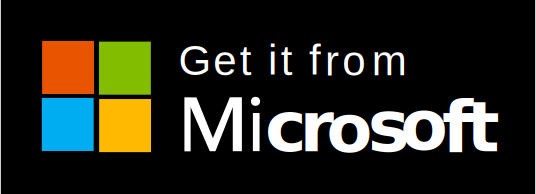

# SuperSpace
这是一个PowerToys Command Palette扩展。


## 语言
[简体中文](./README.md)  
[正體中文](./README(zh-TW).md)  
[English](./README(en-US).md)

## 介绍
这是一个PowerToys Command Palette扩展用于创建或打开xlsx, docx, pptx等文件。

## 下载
-  即刻在 Microsoft Store 下载  
<a href="https://apps.microsoft.com/detail/9NJ4D00C6HBC?hl=zh-hans&gl=TW&ocid=pdpshare">
 
</a>

## 贡献者
<a href="https://github.com/XianYin69/SuperSpace/graphs/contributors">
  
</a>

## 隐私策略声明
```
 *注：“SuperSpace”在本声明中使用“本扩展”替代
```
本扩展是一个本地扩展
- **数据搜集**：本扩展不会收集、存储或是传输任何个人数据。
- **Office 数据**：本扩展仅读取本地的office最近文件来提供文件搜索。
- **网络访问**：本扩展不会使用任何网络功能。

## 许可证
本项目使用[MIT](./LICENSE.txt)协议
